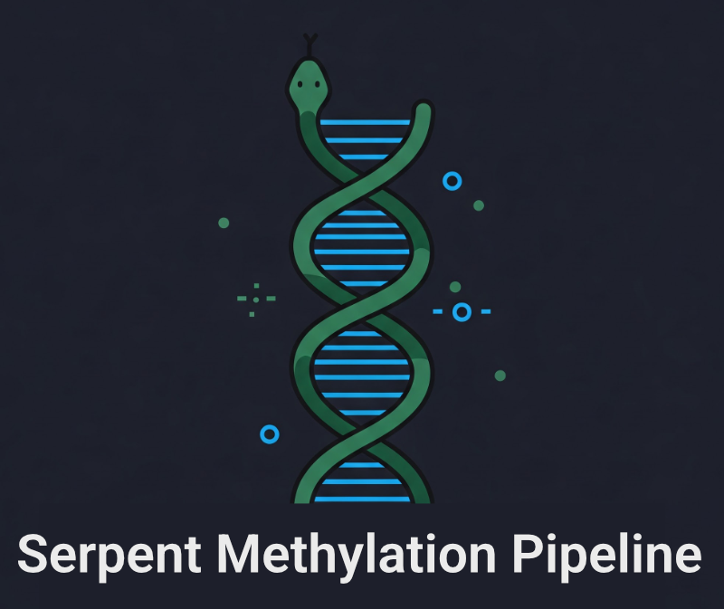

# Serpent Methylation Pipeline (for Snakemake)

[](https://snakemake.github.io)
[](https://opensource.org/licenses/MIT)
[](https://github.com/psf/black)
[](https://www.linux.org/)
[](https://github.com/marketplace/actions/super-linter)
[](https://semenko.github.io/serpent-methylation-pipeline/)



A standardized, reproducible pipeline to process WGBS bisulfite & EM-seq data. This goes from .fastq to methylation calls (via [biscuit](https://github.com/huishenlab/biscuit)) and includes extensive QC and plotting, using a Snakemake pipeline.

## 📖 Documentation

**[View the complete documentation](https://semenko.github.io/serpent-methylation-pipeline/)**

The documentation includes:
- Detailed installation instructions
- Configuration guide
- Usage examples
- Pipeline technical details
- Troubleshooting guide
- API reference

## Quick Start

This pipeline is designed to be straightforward:
1. Clone this repository and open the directory:
   ```
   git clone https://github.com/semenko/serpent-methylation-pipeline.git
   cd serpent-methylation-pipeline
   ```
2. Install Snakemake via [mamba](https://github.com/conda-forge/miniforge#mambaforge) (or conda)
   ```
   mamba install -c bioconda -c conda-forge snakemake snakemake-storage-plugin-http
   ```
3. (Optional) Create a separate conda environment for pipeline dependencies:
   ```
   mamba env create -n serpent_pipeline_env -f workflow/envs/env.yaml
   conda activate serpent_pipeline_env
   ```
4. Test the pipeline:
   ```
   snakemake --cores 4 --use-conda --dry-run
   ```

For detailed instructions, see the [Installation Guide](https://semenko.github.io/serpent-methylation-pipeline/installation.html).

## Features

At a high level, this pipeline reproducibly:
- Builds a reference genome
- Trims & (minimally) filters reads
- Aligns & calls methylation using [biscuit](https://github.com/huishenlab/biscuit)
- Flags non-converted reads
- Generates standardized outputs & QC including
  - [FastQC](https://www.bioinformatics.babraham.ac.uk/projects/fastqc/)
  - [fastp](https://github.com/OpenGene/fastp)
  - Biscuit QC
  - [samtools stats](https://github.com/samtools/samtools)
  - [MethylDackel mbias plots](https://github.com/dpryan79/MethylDackel)
  - [Goleft covplots](https://github.com/brentp/goleft)
  - epibed/epiread files
- Runs [multiqc](https://multiqc.info) across entire projects

## Support

- **Documentation**: [https://semenko.github.io/serpent-methylation-pipeline/](https://semenko.github.io/serpent-methylation-pipeline/)
- **Issues**: [GitHub Issues](https://github.com/semenko/serpent-methylation-pipeline/issues)
- **Discussions**: [GitHub Discussions](https://github.com/semenko/serpent-methylation-pipeline/discussions)

## Contributing

We welcome contributions! Please see the [Contributing Guide](https://semenko.github.io/serpent-methylation-pipeline/contributing.html) in our documentation.
    ├── goleft/                 # goleft coverage plots
    ├── logs/                   # runlogs from each pipeline component
    ├── methyldackel/           # mbias plots
    ├── raw/
    │   ├── ...fastq.gz         # Raw reads
    |   ├── ...md5.txt          # Checksums and validation
    ├── samtools/               # samtools statistics
    SAMPLE_02/
    ...
    ...
    multiqc/                    # A project-level multiqc stats across all data

Note each project also has a `_subsampled` directory with identical structure, which is the result of the pipeline run on only 10M reads/sample.


### Production Runs


## Pipeline Details

This pipeline was designed for highly reproducible, explainable alignments and analysis of epigenetic sequencing data.

### Reference Genome

I chose **GRCh38**, with these specifics:
- No patches
- Includes the hs38d1 decoy
- Includes Alt chromosomes
- Applies the [U2AF1 masking file](https://genomeref.blogspot.com/2021/07/one-of-these-things-doest-belong.html)
- Applies the [Encode DAC exclusion](https://www.encodeproject.org/annotations/ENCSR636HFF/)

You can see a good explanation of the rationale for some of these components at [this NCBI explainer](https://ftp.ncbi.nlm.nih.gov/genomes/all/GCF/000/001/405/GCF_000001405.40_GRCh38.p14/GRCh38_major_release_seqs_for_alignment_pipelines/README_analysis_sets.txt).

### Requirements

All software requirements are specified in [env.yaml](workflow/envs/env.yaml).

Most are relatively common, but a few are semi-unique:
- [biscuit](https://github.com/huishenlab/biscuit) (for alignment)
- NEB's [mark-nonconverted-reads](https://github.com/nebiolabs/mark-nonconverted-reads) (to mark partially converted reads)

biscuit was chosen after a comparison with bwa-meth and bismark — its latest version was the most flexible with extremely well annotated .bams (some critical tags are missing from bwa-meth for identifying read level methylation, and would require patching MethylDackel to extract data).

I briefly experimented with [wgbs_tools](https://github.com/nloyfer/wgbs_tools) (which defines nice .pat/.beta formats) but its licensing is too restrictive to use.

### Trimming Approach

I chose a relatively conservative approach to trimming -- which is needed due to end-repair bias, adaptase bias, and more. 

For **EMseq**, I trim 10 bp everywhere, after personal QC and offline discussions with NEB. See [my notes here](https://github.com/FelixKrueger/Bismark/issues/509).

For **BSseq**, I trim 15 bp 5' R2, and 10 bp everywhere else due to adaptase bias.

For all reads, I set `--trim_poly_g` (due to [two color bias](https://sequencing.qcfail.com/articles/illumina-2-colour-chemistry-can-overcall-high-confidence-g-bases/)) and set a `--length_required` (minimum read length) of 10 bp.

### No Quality Filtering

Notably I do NOT do quality filtering here (I set `--disable_quality_filtering`), and save this for downstream analyses as desired.

I experimented with more stringent quality filtering early on, and found it had little yield / performance benefit. 


## Background & Inspiration

I strongly suggest reading work from Felix Krueger (author of Bismark) as background. In particular:
- TrimGalore's [RRBS guide](https://github.com/FelixKrueger/TrimGalore/blob/master/Docs/RRBS_Guide.pdf)
- The Babraham [WGBS/RRBS tutorials](https://www.bioinformatics.babraham.ac.uk/training.html#bsseq)

For similar pipelines and inspiration, see:
- NEB's [EM-seq pipeline](https://github.com/nebiolabs/EM-seq/)
- Felix Krueger's [Nextflow WGBS Pipeline](https://github.com/FelixKrueger/nextflow_pipelines/blob/master/nf_bisulfite_WGBS)
- The Snakepipes [WGBS pipeline](https://snakepipes.readthedocs.io/en/latest/content/workflows/WGBS.html)


## Pipeline Graph

Here's a high-level overview of the Snakemake pipeline (generated via `snakemake --rulegraph | dot -Tpng > rules.png`)


