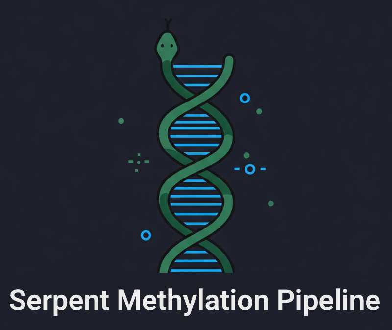

Serpent Methylation Pipeline Documentation
==========================================

A standardized, reproducible pipeline to process WGBS bisulfite & EM-seq data. This goes from .fastq to methylation calls using Snakemake.

.. toctree::
   :maxdepth: 2
   :caption: Contents:

   installation
   usage
   configuration
   pipeline_details
   output_format
   troubleshooting
   api
   contributing

Quick Start
-----------

1. Clone the repository:

.. code-block:: bash

   git clone https://github.com/semenko/serpent-methylation-pipeline.git
   cd serpent-methylation-pipeline

2. Install dependencies:

.. code-block:: bash

   mamba install -c bioconda -c conda-forge snakemake snakemake-storage-plugin-http

3. Test the pipeline:

.. code-block:: bash

   snakemake --cores 4 --use-conda --dry-run

Features
--------

* **Reproducible**: Uses Snakemake for workflow management
* **Comprehensive QC**: Includes FastQC, fastp, biscuit QC, and more
* **Multiple aligners**: Supports both bwameth and biscuit
* **Standardized output**: Generates bed files, epibeds, and QC reports
* **Platform support**: Optimized for Linux systems

Indices and tables
==================

* :ref:`genindex`
* :ref:`modindex`
* :ref:`search`
